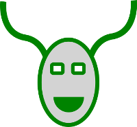

# Kudubot

|master|develop|
|:----:|:-----:|
|[](https://gitlab.namibsun.net/namibsun/python/kudubot/commits/master)|[](https://gitlab.namibsun.net/namibsun/python/kudubot/commits/develop)|



Kudubot is a chat bot framework designed to work with arbitrary messaging
services based on
[bokkichat](https://gitlab.namibsun.net/namibsun/python/bokkichat)
connections.

# Implementing a kudubot

The base of a kudubot is the ```Bot``` class in the ```kudubot.Bot``` module.
Any kudubot implementation must extend that class.

The following methods have to be implemented:

```on_msg```, ```name```, ```parsers```

```on_msg``` is called whenever the bot receives a message. ```name```
defines the name of the bot class. ```parsers``` returns a list of
```CommandParser``` objects.

## Further Information

* [Changelog](CHANGELOG)
* [License (GPLv3)](LICENSE)
* [Gitlab](https://gitlab.namibsun.net/namibsun/python/kudubot)
* [Github](https://github.com/namboy94/kudubot)
* [Progstats](https://progstats.namibsun.net/projects/kudubot)
* [PyPi](https://pypi.org/project/kudubot)
